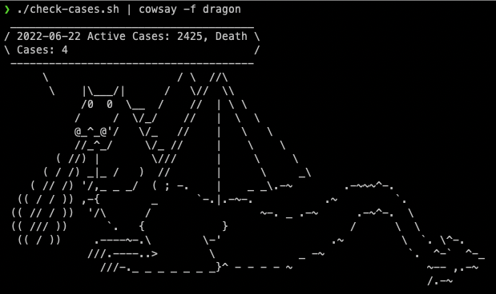
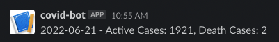

# Check Covid Cases in Malaysia
This is a simple shell script (using curl) to check daily Covid active and death cases in Malaysia. The data is extracted from MoH Github repository, which is updated daily at midnight.

## Run

    ./check-cases.sh
    2022-06-22 Active Cases: 2425, Death Cases: 4

Pipe this script to `cowsay` to make it.. not so dull.
    
    ./check-cases.sh | cowsay -f dragon



## Send to Slack / Discord
To get the MY Covid cases automatically everyday, you could setup a cron job on your machine. Or if you like me and prefer to spin up a Docker container and receive the message on Slack or Discord, follow the steps below:
1. Setup a webhook to the [Slack](https://api.slack.com/messaging/webhooks) or [Discord](https://support.discord.com/hc/en-us/articles/228383668-Intro-to-Webhooks) channel that you want to receive the message.

2. Copy the webhook URL

3. Build the image using the provided Dockerfile. Note that the timezone is set to Asia/Kuala_Lumpur, this will affect the timing set at the cron job. Feel free to change this if this is not your preferred timezone.
```
    docker build -t check-covid:0.1
```

4. Create a docker-compose.yaml, replace the respective webhook URL to the one you gotten from step (1). If you want to send to only 1 of the messenger, feel free to remove the respective YAML. 
    - TYPE - Type of the messenger, DISCORD or SLACK
    - CRON_SCHEDULE - The schedule to run the cron job, following [cron format](https://en.wikipedia.org/wiki/Cron).

```yaml
version: '3'
services:

  discord:
    image: check-covid:0.1
    environment:
      - TYPE=DISCORD
      - URL=<DISCORD_WEBHOOK>
      - CRON_SCHEDULE=30 9 * * *
  
  slack:
    image: check-covid:0.1
    environment:
      - TYPE=SLACK
      - URL=<SLACK_WEBHOOK>
      - CRON_SCHEDULE=30 9 * * *
```
5. Spin up the docker containers, specifying `-d` would run this in detached mode.
```
docker-compose up -d
```

6. Verify 


